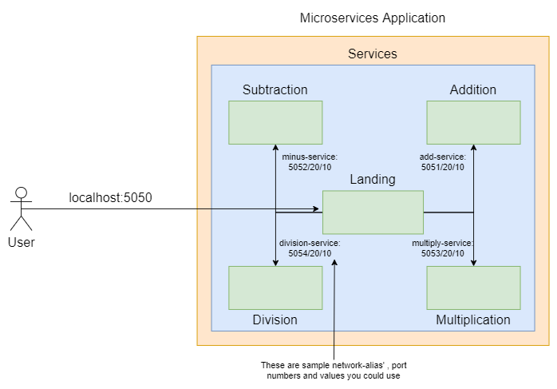

# Breaking down monoliths 🪨⛏️

Convert a monolith architecture based docker-compose application into a microservices based architecture.  

## Team 
[Rohan M](https://github.com/rohanmrb)<br>
[Rushab](https://github.com/rushab14)

## Requirements:
- [docker](https://docs.docker.com/engine/) and [docker-compose](https://docs.docker.com/compose/install/). Follow the guides based on your operating system.
- Internet. Pull docker image `python:3.8-alpine` beforehand to avoid connectivity issues.

## Directory structure for monolithic architecture
```
├── README.md
├── docs
│   └── <documentation related images/files>
├── microservices
│   ├── Docker-compose.yaml
│   ├── landing
│   │   ├── app
│   │   │   ├── app.py
│   │   │   ├── requirements.txt
│   │   │   └── templates
│   │   │       └── index.html
│   │   └── Dockerfile
│   │
```
## Monolith architecture diagram
<p align="center">
  
</p>

## Build & Run
```
# under the microservices directory
docker-compose build
```
### To stop the services in detached mode
```
docker-compose down
```


## Project
1. ### Docker File 
      - Dockerfiles help building images using a given set of instructions. You can learn about the basics of Dockerfiles [here](https://docs.docker.com/engine/reference/builder/). Use this document to understand the meaning of certain keywords used by Dockerfiles.<br><br>
2. ### Error Handling
    #### 2.1 Variable type of the incoming values from index.html
      - By default, Python considers all input as string. The types are checked in the ```app.py``` of every microservice  
      - Fix the type of the two variable values received from ```index.html```
    #### 2.2 Handling the None type exception 
      - Avoid the crash by handling the exceptions raised in the landing-service app.<br><br>

3. ### Breaking the monolith architecture
    #### 2.0. Decoupling the arithmetic functions.
      - The four arithmetic functions if they reside under landing-service and the landing-service were to become unavailable for whatever reason, the four functions would be unavailable as well.
      - The ```Docker-compose.yaml``` is updated to recognize the flask applications as separate services. **The ```Docker-compose.yaml``` defines the port number and network alias that will be used by ```landing-service``` to communicate within the entire architecture**<br><br>
    #### 2.1. Adding more services
      - ```add```: Takes two numbers as arguments and returns their **sum**
      - ```subtract```: Takes two numbers as arguments and returns their **difference**
      - ```multiply```: Takes two numbers as arguments and returns their **product**
      - ```division```: Takes two numbers as arguments and returns their **quotient**
      - ```gcd```: Takes two numbers as arguments and returns their **Greatest Common Divisor**
      - ```lcm```: Takes two numbers as arguments and returns their **Least Common Multiple**
      - ```modulus```: Returns the remainder of two numbers after division. **Reference**
      - ```exponent```: Returns the result of the arithmetic operation **a<sup>b</sup>**
      - ```greater_than```: Return ```True``` if the first value is greater than the second else ```False```
      - ```less_than```: return ```True``` if the first value is less than the second else ```False```
      - ```equal```: return ```True``` if the first value is equal to the second else ```False```


## Microservices-based architecture diagram after decomposition
<p align="center">
  
  
</p>


## Miscellaneous
- Directory structure of additional arithmetic microservices:
```
├── <name of the service>
│   ├── Dockerfile           # same as landing/Dockerfile
│   ├── app
│   │   ├── app.py           
│   │   └── requirements.txt 
│   │  
```


